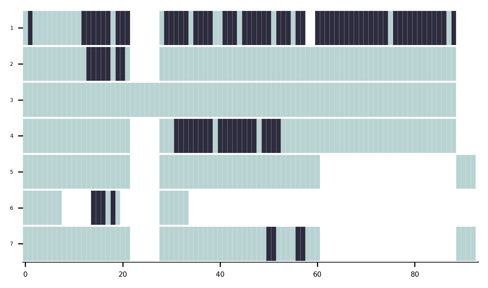
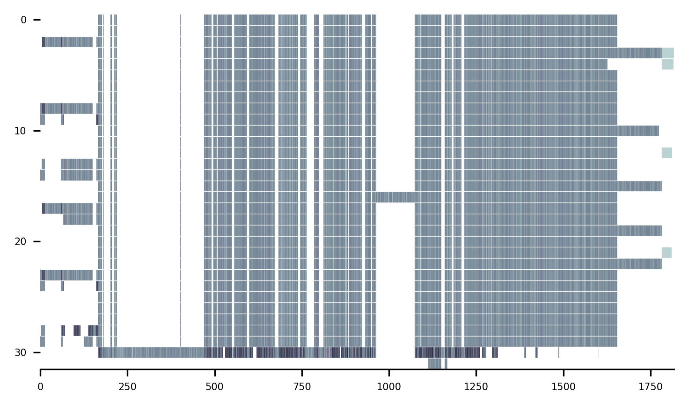
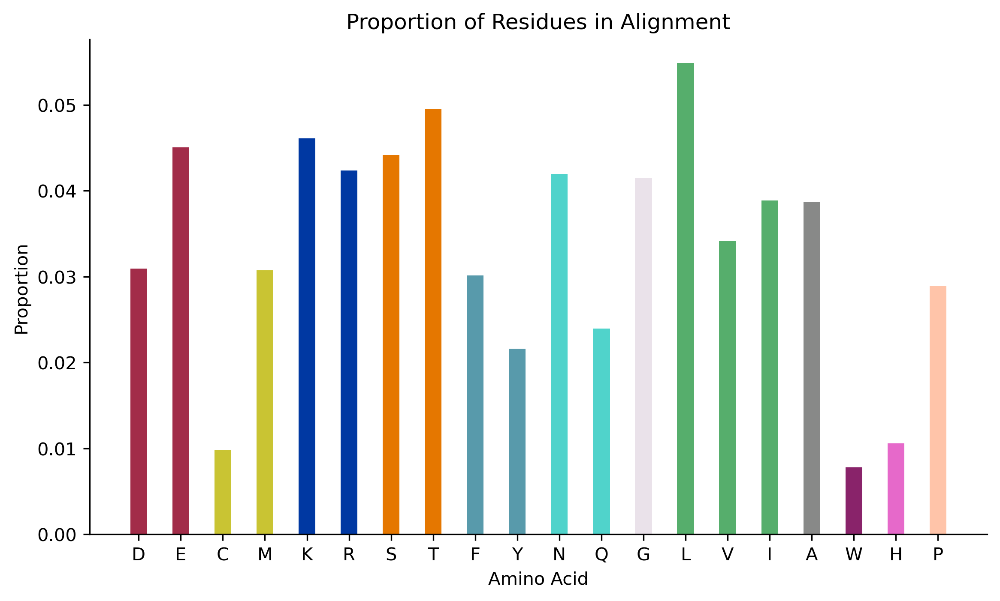
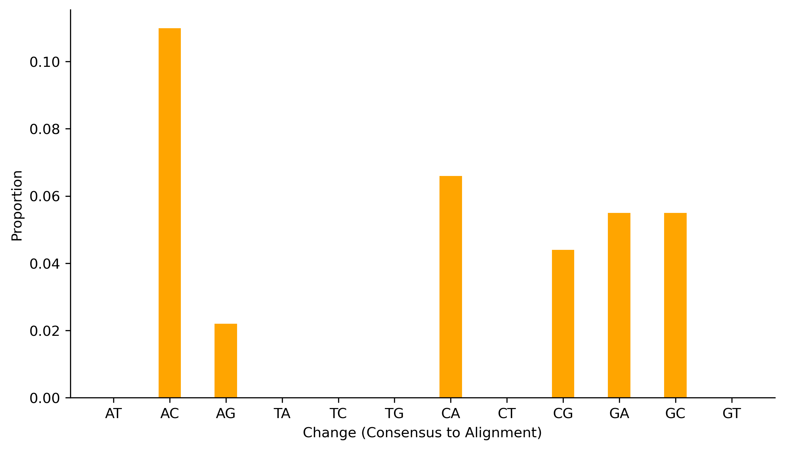

## Usage

1. [Input Files](#input-files)
2. [Quick Start](#quick-start)
3. [Options](#specifying-options)
4. [Basic Parameters](#basic-parameters)
5. [Cleaning Functions](#cleaning-functions)
6. [Visualisation Functions](#visualisation-functions)
7. [Interpretation functions](#interpretation-functions)
8. [Editing functions](#editing-functions)

CIAlign is used to process multiple sequence alignments (MSAs) - sets of nucleotide or amino acid sequences which have already been aligned with an external tool.

### Input Files
The input for CIAlign is an aligned MSA in FASTA format.

### Quick Start
`CIAlign --infile INFILE --outfile_stem STEM OPTIONS`

Where INFILE is the FASTA file you would like to process, STEM is a prefix for the output files and OPTIONS lists the functions you would like to run and the parameters you would like to use.

For example, to run the remove insertions function, with default settings, on the file `example1.fasta` and generate `ri_clean.fasta`.

`CIAlign --infile example1.fasta --outfile_stem ri --remove_insertions`

To run all functions with the default settings (please use this option cautiously):

`CIAlign --infile example1.fasta --all`

### Specifying Options
Parameters can be specified in the command line OPTIONS or in a config file.

A template config file is provided in `CIAlign/templates/ini_template.ini` - edit this file and provide the path to the `--inifile` argument.

`CIAlign --infile INFILE --outfile_stem STEM --inifile my_inifile.ini`

If this argument is not provided command line arguments and defaults will be used.

Parameters passed in the command line will take precedence over config file parameters, which take precedence over defaults.

Command help can be accessed by typing `CIAlign --help`

### Basic Parameters

| Parameter | Description | Default |
| ------------------------------------------------------ |------------------------------------------------------------------------------------- | ------------ |
| `--infile` | Path to input alignment file in FASTA format | None |
| `--inifile` | Path to config file | None |
| `--outfile_stem` | Prefix for output files, including the path to the output directory | CIAlign |
| `--all` | Use all available cleaning, visualisation and interpretation functions with default parameters| False |
| `--clean` | Use all available cleaning functions with default parameters | False |
| `--visualise` | Use all available mini alignment visualisation functions with default parameters | False |
| `--interpret` | Use all available interpretation functions with default parameters | False |
| `--silent` | Do not print progress to the screen | False |
| `--help` | Show all available parameters with an explanation | None |
| `--version` | Show the version | None |

Beside these main parameters, the use of every function and corresponding thresholds can be specified by the user by adding parameters to the command line or by setting them in the configuration file. Available functions and their parameters are specified below.

CIAlign always produces a log file, specifying which functions have been run with witch parameters and what has been removed. It also outputs a machine parsable file that only specifies what has been removed with the original column positions and the sequence names.

Output files:

* **`OUTFILE_STEM_log.txt`** - general log file
* **`OUTFILE_STEM_removed.txt`** - removed columns positions and sequence names text file

### Cleaning Functions
The CIAlign cleaning functions are designed to address several common issues with multiple sequence alignments, affecting the speed, complexity and reliability of specific downstream analyses. 

All of these functions remove columns or rows from the alignment to address sources of noise.

* [Remove divergent](#remove-divergent)
* [Remove insertions](#remove-insertions)
* [Crop ends](#crop-ends)
* [Remove short](#remove-short)
* [Remove gap only](#remove-gap-only)
* [Crop divergent](#crop-divergent)

Each of these steps (if specified) will be performed sequentially in the order specified in the table below.

`remove_divergent`, `remove_insertions`, `crop_ends` and `crop divergent` require three or more sequences in the alignment, `remove_short` and `remove_gap_only` require two or more sequences.

Output files:

The "cleaned" alignment after all steps have been performed will be saved as **`OUTFILE_STEM_cleaned.fasta`**

The [retain](#retain) functions allow the user to specify sequences to keep regardless of the CIAlign results.

#### Remove Divergent

Removes divergent (outlier) sequences from the alignment. It is very common for an MSA to include one or a few outlier sequences which do not align well with the majority of the alignment. For some applications it is useful to remove these.

The remove divergent function specifically removes sequences with <= `remove_divergent_minperc` positions at which the most common residue in the alignment is present.

| Parameter | Description | Default Value | Min | Max |
| --------- |------------ | ------------- | --- | --- |
| **`--remove_divergent`** |  Remove sequences with <= `remove_divergent_minperc` positions at which the most common base / amino acid in the alignment is present | False | NA | NA |
| *`--remove_divergent_minperc`* | Minimum proportion of positions which should be identical to the most common base / amino acid in order to be preserved | remove_divergent_minperc_def | remove_divergent_minperc_min | remove_divergent_minperc_max |
| *`--remove_divergent_retain`* | Do not remove sequences with this name when running the remove divergent function | None | NA | NA |
| *`--remove_divergent_retain_str`* | Do not remove sequences with names containing this character string when running the remove divergent function | None | NA | NA |
| *`--remove_divergent_retain_list`* | Do not remove sequences with names listed in this file when running the remove divergent function | None | NA | NA |

#### Remove Insertions

Removes insertions which are not present in the majority of sequences (or regions which are deleted in the majority of sequences).  Insertions or other stretches of sequence which are only present in a minority of sequences can lead to large gaps, these are sometimes of interest but can also complicate downstream analysis.

The remove insertions function removes regions from the alignment which are found in <= `insertion_min_perc` of the sequences but are surrounded by >= `insertion_min_flank` columns of higher coverage.

| Parameter | Description | Default Value | Min | Max |
| ---------------------------------------------------------------- |--------------------------------------------------------------------------------------------------- | ------------ |-----|------|
| **`--remove_insertions`** |  Remove insertions found in <= `insertion_min_perc` of sequences from the alignment | False | NA | NA |
| *`--insertion_min_size`* | Only remove insertions >= this number of residues | insertion_min_size_def | insertion_min_size_min | insertion_min_size_max |
| *`--insertion_max_size`* |  Only remove insertions <= this number of residues | insertion_max_size_def | insertion_max_size_min | insertion_max_size_max |
| *`--insertion_min_flank`* | Minimum number of bases on either side of an insertion to classify it as an insertion | insertion_min_flank_def | insertion_min_flank_min | insertion_min_flank_max |
| *`--insertion_min_perc`* | Remove insertions which are present in less than this proportion of sequences | insertion_min_perc_def | insertion_min_perc_min | insertion_min_perc_max |

#### Crop Ends
It is common for an MSA to contain more gaps towards either end than in the body of the alignment, due to (for example) increased sequencing error towards the ends of reads, lower read coverage or assembly issues.

The crop ends function crops the ends of individual sequences if they contain a high proportion of gaps relative to the rest of the alignment. The number of gap positions separating every two consecutive non-gap positions at either end of the sequence is compared to a threshold (calculated from the total sequence length using `crop_ends_mingap_perc`) and if that difference is higher than the threshold, the start of the sequence will be reset to that position.

| Parameter | Description | Default Value | Min | Max |
| ---------------------------------------------------------------- |--------------------------------------------------------------------------------------------------- | ------------ |-----|------|
| **`--crop_ends`** | Crop the ends of sequences if they are poorly aligned | False | NA | NA |
| *`--crop_ends_mingap_perc`* |  Minimum proportion of the sequence length (excluding gaps) that is the threshold for change in gap numbers. | crop_ends_mingap_perc_def | crop_ends_mingap_perc_min | crop_ends_mingap_perc_max |
| *`--crop_ends_redefine_perc`* |  Proportion of the sequence length (excluding gaps) that is being checked for change in gap numbers to redefine start/end. |  crop_ends_redefine_perc_def | crop_ends_redefine_perc_min | crop_ends_redefine_perc_max |
| *`--crop_ends_retain`* | Do not crop sequences with this name when running the crop ends function | None | NA | NA |
| *`--crop_ends_retain_str`* | Do not crop sequences with names containing this character string when running the crop ends function | None | NA | NA |
| *`--crop_ends_retain_list`* | Do not crop sequences with names listed in this file when running the crop ends function | None | NA | NA |

Note: if the sequences are short (e.g. < 100), a low crop_ends_mingap_perc (e.g. 0.01) will result in a change of gap numbers that is too low (e.g. 0). If this happens, the change in gap numbers will be set to 2 and a warning will be printed.

#### Remove Short

Removes short sequences below a threshold length.

| Parameter | Description | Default Value | Min | Max |
| ---------------------------------------------------------------- |--------------------------------------------------------------------------------------------------- | ------------ |-----|------|
| **`--remove_short`** | Remove sequences <= `remove_min_length`  amino acids from the alignment | False | NA | NA |
| *`--remove_min_length`* | Sequences are removed if they are shorter than this minimum length, excluding gaps. | remove_min_length_def | remove_min_length_min | remove_min_length_max |
| *`--remove_short_retain`* | Do not remove sequences with this name when running the remove short function | None | NA | NA |
| *`--remove_short_retain_str`* | Do not remove sequences with names containing this character string when running the remove short function | None | NA | NA |
| *`--remove_short_retain_list`* | Do not remove sequences with names listed in this file when running the remove short function | None | NA | NA |

#### Remove Gap Only

Removes columns containing only gaps. This function is run by default, to not run this function specify `--keep_gaponly`.

| Parameter | Description | Default Value | Min | Max |
| ---------------------------------------------------------------- |--------------------------------------------------------------------------------------------------- | ------------ |-----|------|
| **`--keep_gaponly`** | Keep gap only columns in the alignment | False | NA | NA |

#### Crop Divergent

Some alignments have a region which is clearly of higher quality than the surrounding alignment, with less diversity and fewer gaps. This can be the case when regions have been extracted, e.g. from a full genome, but the start and end positions of the region of interest are not well defined·

The crop divergent function redefines the start and end positions of an alignment by looking for `crop_divergent_buffer_size` consecutive columns which have a minimum proportion of identical residues >= `crop_divergent_min_prop_ident` and a minimum proportion of non-gap residues >= `crop_divergent_min_prop_nongap`, then taking the first or last such column as the alignment start or end.

| Parameter | Description | Default Value | Min | Max |
| ---------------------------------------------------------------- |--------------------------------------------------------------------------------------------------- | ------------ |-----|------|
| **`--crop_divergent`** |  Crop either end of the alignment until > `crop_divergent_min_prop_ident` residues in a column are identical and > `crop_divergent_min_prop_nongap` residues are not gaps, over `buffer_size` consecutive columns |  False | NA | NA |
| *`--crop_divergent_min_prop_ident`* |  Minumum proportion of identical residues in a column to be retained by crop_divergent |  divergent_min_prop_ident_def | divergent_min_prop_ident_min | divergent_min_prop_ident_max |
| *`--crop_divergent_min_prop_nongap`* |  Minumum proportion of non gap residues in a column to be retained by crop_divergent |  divergent_min_prop_nongap_def | divergent_min_prop_nongap_min | divergent_min_prop_nongap_max |
| *`--crop_divergent_buffer_size`* |  Minumum number of consecutive columns which must meet the criteria for crop_divergent to be retained |  divergent_buffer_size_def | divergent_buffer_size_min | divergent_buffer_size_max |

#### Retain

These parameters allow the user to specify sequences which should not be removed from the alignment. 

The sequences can be specified by providing one or more sequence names (`--retain`), a character string to match in the names (`--retain_str`) or a file containing a list of names (`--retain_list`).

The crop ends, remove divergent and remove short functions also have the option to specify sequence names to ignore with those specific functions only.

| Parameter | Description | Default Value | Min | Max |
| ---------------------------------------------------------------- |--------------------------------------------------------------------------------------------------- | ------------ |-----|------|
| **`--retain`** | Do not edit or remove sequences with this name when running any rowwise function (currently remove divergent, crop ends and remove short) | None | NA | NA |
| **`--retain_str`** | Do not edit or remove sequences with names containing this character string when running any rowwise function | None | NA | NA |
| **`--retain_list`** | Do not edit or remove sequences with names listed in this file when running any rowwise function | None | NA | NA |

### Visualisation functions

Each of these functions produces some kind of visualisation of an MSA.

#### Mini Alignments
These functions produce "mini alignments" - images showing a small representation of your whole alignment, so that gaps and poorly aligned regions are clearly visible.

##### Mini alignment example

In standard mini alignments, each nucleotide or amino acid is shown in a different colour, based on the [palettes](#palettes) shown below.

##### Identity plot example

In identity plots, each nucleotide or amino acid in the cleaned alignment is compared to a consensus (generated with the [majority_nongap](#consensus-sequences) method), with matches, mismatches and gaps shown in different colours. The colours for matches and mismatches are the extremes from the [matplotlib palettes](https://matplotlib.org/stable/users/explain/colors/colormaps.html) and can be changed with the `plot_identity_palette` parameter, the gap colour is fixed and set using the `plot_identity_gap_col` parameter.

##### Similarity plot example

In similarity plots, each nucleotide or amino acid in the cleaned alignment is compared to a consensus (generated with the [majority_nongap](#consensus-sequences) method) and a similarity score is calculated using a substitution matrix. The BLAST substitution matrices available [here](https://ftp.ncbi.nih.gov/blast/matrices/) are used. All available matrices are listed [here](https://github.com/KatyBrown/CIAlign/blob/master/CIAlign/matrices.txt). This score is used to determine the colour to show in the plot. The colours are from the [matplotlib palettes](https://matplotlib.org/stable/users/explain/colors/colormaps.html) and can be changed with the `plot_similarity_palette` parameter, the gap colour is fixed and set using the `plot_similarity_gap_col` parameter.

Output files:

* **`OUTFILE_STEM_input.png (or svg, tiff, jpg)`** - visualisation of the input alignment
* **`OUTFILE_STEM_output.png (or svg, tiff, jpg)`** -  visualisation of the cleaned output alignment
* **`OUTFILE_STEM_markup.png (or svg, tiff, jpg)`** - visualisation of the input alignment with deleted rows and columns marked
* **`OUTFILE_STEM_consensus_identity.png (or svg, tiff, jpg)`** - visualisation of the differences between the cleaned alignment and a consensus (generated with the [majority_nongap](#consensus-sequences) method)
* **`OUTFILE_STEM_consensus_similarity.png (or svg, tiff, jpg)`** - visualisation of the similarity between the cleaned alignment and a consensus (generated with the [majority_nongap](#consensus-sequences) method)

| Parameter | Description | Default |
| ------------------------------------------------------ |------------------------------------------------------------------------------------------------------------- | ------------ |
| **`--plot_input`** | Plot a mini alignment - an image representing the input alignment | False |
| **`--plot_output`** | Plot a mini alignment - an image representing the output alignment | False |
| **`--plot_markup`** | Draws the input alignment but with the columns and rows which have been removed by each function marked up in corresponding colours | False |
|**`--plot_consensus_identity`**| Plot a mini alignment showing positions which are identical to or differ from the consensus. | False |
|**`--plot_consensus_similarity`**| Plot a mini alignment showing positions based on their score when when compared via a substitution matrix to the consensus. | False |
| *`--plot_dpi`* | DPI for mini alignments | 300 |
| *`--plot_format`* | Image format for mini alignments - can be png, svg, tiff or jpg | png |
| *`--plot_width`* | Mini alignment width in inches | 5 |
| *`--plot_height`* | Mini alignment height in inches | 3 |
| *`--plot_keep_numbers`* | Label rows in mini alignments based on input alignment, rather than renumbering | False |
| *`--plot_force_numbers`* | Force all rows in mini alignments to be numbered rather than labelling e.g. every 10th row for larger plots Will cause labels to overlap in larger plots | False |
| *`--plot_sub_matrix_name`* | Substitution matrix to use for similarity plots |  BLOSUM62 for amino acid, NUC.4.4 for nucleotide  |
| *`--plot_identity_palette`* | Matplotlib palette name for identity mini alignments. | bone |
| *`--plot_identity_gap_col`* | Colour for gap positions in identity mini alignments | white |
| *`--plot_similarity_palette`* | Matplotlib palette name for similarity mini alignments | bone |
| *`--plot_similarity_gap_col`* | Colour for gaps in similarity mini alignments | white |

#### Sequence logos
These functions draw sequence logos representing output (cleaned) alignment using the algorithm specified by [Schneider (1990)(]https://www.ncbi.nlm.nih.gov/pmc/articles/PMC332411/).

Traditional "text" sequence logos can be produced as well as bar charts summarising the same information.

**Text**

**Bar**

 You can also specify a subsection of the alignment using the `logo_start` and `logo_end` arguments, positions should be relative to the input alignment. If no cleaning functions are specified, the logo will be based on your input alignment.

Output_files:

* **`OUTFILE_STEM_logo_bar.png (or svg, tiff, jpg)`** - the alignment represented as a bar chart
* **`OUTFILE_STEM_logo_text.png (or svg, tiff, jpg)`** - the alignment represented as a standard sequence logo using text

| Parameter | Description | Default |
| ------------------------------------------------------ |------------------------------------------------------------------------------------------------------------- | ------------ |
| **`--make_sequence_logo`** | Draw a sequence logo | False |
| *`--sequence_logo_type`* | Type of sequence logo - bar/text/both | bar |
| *`--sequence_logo_dpi`* | DPI for sequence logo | 300 |
| *`--sequence_logo_font`* | Font (see NB below) for bases / amino acids in a text based sequence logo | monospace |
| *`--sequence_logo_nt_per_row`* | Number of bases / amino acids to show per row in the sequence logo, where the logo is too large to show on a single line | 50 |
| *`--sequence_logo_filetype`* | Image file type to use for the sequence logo - can be png, svg, tiff or jpg | png |
| *`--logo_start`* | Start sequence logo | 0 |
| *`--logo_end`* | End of sequence logo | MSA length |

NB: to see available fonts on your system, run CIAlign --list_fonts_only and view CIAlign_fonts.png

#### Statistics Plots
For each position in the alignment (input or output), these functions plot:
* Coverage (the number of non-gap residues)
* Information content
* Shannon entropy

The following plots are also generated for the whole alignment (input or output). 
* Nucleotide or amino acid frequencies, for nucleotides the A/T(U) vs C/G content is also shown. For these plots, colours are based on the CBS [palette](#palettes).
* For nucleotide alignments, the frequency of each nucleotide "change" relative to a consensus generated with the [majority_nongap](#consensus-sequences) method.

**Coverage**

**Information Content**

**Shannon Entropy**

**Nucleotide Frequency**

**Amino Acid Frequency**

**Nucleotide Change**

Output files:

* **`OUTFILE_STEM_input_coverage.png (or svg, tiff, jpg) `** - image showing the input alignment coverage
* **`OUTFILE_STEM_output_coverage.png (or svg, tiff, jpg) `** - image showing the output alignment coverage
* **`OUTFILE_STEM_input_information_content.png (or svg, tiff, jpg) `** - image showing the input alignment information content
* **`OUTFILE_STEM_output_information_content.png (or svg, tiff, jpg) `** - image showing the output alignment information content
* **`OUTFILE_STEM_input_shannon_entropy.png (or svg, tiff, jpg) `** - image showing the input alignment Shannon entropy
* **`OUTFILE_STEM_output_shannon_entropy.png (or svg, tiff, jpg) `** - image showing the output alignment Shannon entropy
* **`OUTFILE_STEM_input_resfreq.png (or svg, tiff, jpg) `** - image showing the input alignment residue frequencies
* **`OUTFILE_STEM_output_resfreq.png (or svg, tiff, jpg) `** - image showing the output alignment residue frequencies
* **`OUTFILE_STEM_input_changefreq.png (or svg, tiff, jpg) `** - image showing the input alignment changes relative to the consensus (nt only)
* **`OUTFILE_STEM_output_changefreq.png (or svg, tiff, jpg) `** - image showing the output alignment changes relative to the consensus (nt only)

| Parameter | Description | Default |
| ---------------------------------------------------- |------------------------------------------------------------------------------------------------------------- | ------------ |
| **`--plot_stats_input`** | Plot the statistics for the input MSA | False |
| **`--plot_stats_output`** | Plot the statistics for the output MSA | False |
| *`--plot_stats_dpi`* | DPI for coverage plot | 300 |
| *`--plot_stats_height`* | Height for coverage plot (inches) | 3 |
| *`--plot_stats_width`* | Width for coverage plot (inches) | 5 |
| *`--plot_stats_colour`* | Colour for coverage plot (hex code or name) | #007bf5 |
| *`--plot_stats_filetype`* | File type for coverage plot (png, svg, tiff, jpg) | png |

#### Palettes

This function sets the colour palette for the mini alignments. Currently available palettes are colour blind safe (CBS) and bright.

**CBS**

**Bright**

| Parameter | Description | Default Value |
| ---------------------------------------------------------------- |--------------------------------------------------------------------------------------------------- | ------------ |
| **`--palette`** | Colour palette. Currently implemented CBS (colourblind safe) and bright| CBS |

### Interpretation Functions
These functions provide additional analyses you may wish to perform on your alignment.

#### Consensus Sequences
This step generates a consensus sequence based on the cleaned alignment.  If no cleaning functions are performed, the consensus will be based on the input alignment.

Consensus sequences can be `majority` - the most common character in each column is used, including gaps or `majority_nongap` - the most common non-gap character is used.

Where the two most frequent characters are equally common a random character is selected.

Once the consensus has been generated, gap positions are automatically removed, specifying `---consensus_keep_gaps` prevents this.

Output files:

* **`OUTFILE_STEM_consensus.fasta`** - the consensus sequence only
* **`OUTFILE_STEM_with_consensus.fasta`** - the cleaned alignment plus the consensus

| Parameter | Description | Default |
| ------------------------------------------------------ |------------------------------------------------------------------------------------------------------------- | ------------ |
| **`--make_consensus`** | Make a consensus sequence based on the cleaned alignment | False |
| *`--consensus_type`* | Type of consensus sequence to make - can be majority, to use the most common character at each position in the consensus, even if this is a gap, or majority_nongap, to use the most common non-gap character at each position | majority |
| *`--consensus_keep_gaps`* | If there are gaps in the consensus (if majority_nongap is used as consensus_type), should these be included in the consensus (True) or should this position in the consensus be deleted (False) | False |
| *`--consensus_name`* | Name to use for the consensus sequence in the output fasta file | consensus |

#### Position Frequency, Probability and Weight Matrices

These functions are used to create a position weight matrix, position frequency matrix or position probability matrix for your input or output (cleaned) alignment. These are numerical representations of the alignment which can be used as input for various other software, for example to find regions of another sequence resembling part of your alignment. PFMs, PPMs and PWMs are described well in the Wikipedia article [here](https://en.wikipedia.org/wiki/Position_weight_matrix). 

You can also specify a subsection of the alignment using the `pwm_start` and `pwm_end` arguments, positions should be relative to the input alignment.

Output_files:

* **`OUTFILE_STEM_pwm_(input/output).txt`** - position weight matrix representing the alignment (or part of the alignment)

* **`OUTFILE_STEM_ppm_(input/output).txt`** - position probability matrix representing the alignment (or part of the alignment)

* **`OUTFILE_STEM_pfm_(input/output).txt`** - position frequency matrix representing the alignment (or part of the alignment)

* **`OUTFILE_STEM_ppm_meme_(input/output).txt`** - position probability matrix representing the alignment (or part of the alignment) in the format used by the MEME software suite.

* **`OUTFILE_STEM_blamm_(input/output).png`** - position probability matrix representing the alignment (or part of the alignment) in the format used by the BLAMM software tool.

| Parameter | Description | Default |
| ------------------------------------------------------ |------------------------------------------------------------------------------------------------------------- | ------------ |
| **`--pwm_input`** | Generate a position frequency matrix, position probability matrix and position weight matrix based on the input alignment | False |
| **`--pwm_output`** | Generate a position frequency matrix, position probability matrix and position weight matrix based on the cleaned output alignment | False |
| *`--pwm_start`* | Start the PWM and other matrices from this column of the input alignment | None |
| *`--pwm_end`* | Start the PWM and other matrices from this column of the input alignment | None |
| *`--pwm_freqtype`* | Type of background frequency matrix to use when generating the PWM. Should be 'equal', 'calc', 'calc2' or 'user'. 'equal', assume all residues are equally common, 'calc', frequency is calculated using the PFM,  'calc2', frequency is calculated using the full alignment (same as calc if pwm_start and pwm_end are not specified). | equal |
| *`--pwm_alphatype`* | Alpha value to use as a pseudocount to avoid zero values in the PPM. Should be 'calc' or 'user'. If alphatype is 'calc', alpha is calculated as frequency(base) * (square root(n rows in alignment)), as described in Dave Tang's blog [here](https://davetang.org/muse/2013/10/01/position-weight-matrix/), which recreates the method used in [Wasserman & Sandelin 2004](doi.org/10.1038/nrg1315). If alpha type is 'user' the user provides the value of alpha as `pwm_alphatype`. To run without pseudocounts set `pwm_alphatype` as user and `pwm_alphaval` as 0 | calc |
| *`--pwm_alphaval`* | User defined value of the alpha parameter to use as a pseudocount in the PPM. | 1 |
| *`--pwm_output_blamm`* | Output PPM formatted for [BLAMM](https://github.com/biointec/blamm) software | False 
| *`--pwm_output_meme`* | Output PPM formatted for [MEME](https://meme-suite.org/meme) software | False |

#### Similarity Matrices

Generates a matrix showing the proportion of identical bases / amino acids between each pair of sequences in the MSA.

Output file:

* **`OUTFILE_STEM_input_similarity.tsv`** - similarity matrix for the input file
* **`OUTFILE_STEM_output_similarity.tsv`** - similarity matrix for the output file

| Parameter | Description | Default |
| ------------------------------------------------------ |------------------------------------------------------------------------------------------------------------- | ------------ |
| **`--make_similarity_matrix_input`** | Make a similarity matrix for the input alignment | False |
| **`--make_similarity_matrix_output`** | Make a similarity matrix for the output alignment | False |
| *`--make_simmatrix_keepgaps`* | 0 - exclude positions which are gaps in either or both sequences from similarity calculations, 1 - exclude positions which are gaps in both sequences, 2 - include all positions  | 0 |
| *`--make_simmatrix_dp`* | Number of decimal places to display in the similarity matrix output file | 4 |
| *`--make_simmatrix_minoverlap`* | Minimum overlap between two sequences to have non-zero similarity in the similarity matrix | 1 |

### Editing Functions
#### Extracting part of the alignment
This function allows the user to specify a start and end position to isolate part of the alignment, using the --section_start and --section_end position. The section must be at least 5 residues in length. The section which has been isolated will then be used for all other processing with CIAlign. 

If parsing functions are also specified, the positions output in the log files will be relative to the original input file, rather than the section.

| Parameter | Description | Default |
| ------------------------------------------------------ |------------------------------------------------------------------------------------------------------------- | ------------ |
| `--get_section` | Allows the user to specify a section of the alignment to be extracted and processed| False |
| `--section_start` | Start position in the original alignment for the section to be extracted | None |
| `--section_end` | End position in the original alignment for the section to be extracted | None |

#### Replacing U or T
This function replaces the U nucleotides with T nucleotides or vice versa without otherwise changing the alignment.

Output files:

* **`OUTFILE_STEM_T_input.fasta`** - input alignment with T's instead of U's
* **`OUTFILE_STEM_T_output.fasta`** - output alignment with T's instead of U's

or

* **`OUTFILE_STEM_U_input.fasta`** - input alignment with U's instead of T's
* **`OUTFILE_STEM_U_output.fasta`** - output alignment with U's instead of T's

| Parameter | Description | Default |
| ------------------------------------------------------ |------------------------------------------------------------------------------------------------------------- | ------------ |
| `--replace_input_tu` | Generates a copy of the input alignment with T's instead of U's | False |
| `--replace_output_tu` | Generates a copy of the output alignment with T's instead of U's | False |
| `--replace_input_ut` | Generates a copy of the input alignment with U's instead of T's | False |
| `--replace_output_ut` | Generates a copy of the output alignment with U's instead of T's | False |

#### Unaligning (removing gaps)
This function simply removes the gaps from the input or output alignment and creates and unaligned file of the sequences.

Output files:

* **`OUTFILE_STEM_unaligned_input.fasta`** - unaligned sequences of input alignment
* **`OUTFILE_STEM_unaligned_output.fasta`** - unaligned sequences of output alignment

| Parameter | Description | Default |
| ------------------------------------------------------ |------------------------------------------------------------------------------------------------------------- | ------------ |
| `--unalign_input` | Generates a copy of the input alignment with no gaps | False |
| `--unalign_output` | Generates a copy of the output alignment with no gaps | False |

